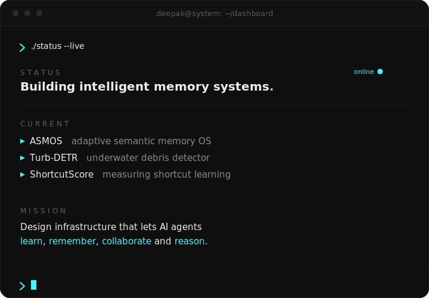

<!--
  C S Deepak · GitHub profile README
  ⚠ Renders on the profile page only if the repo is named exactly `csdeepak`
    → github.com/csdeepak/csdeepak  (see SETUP.md).
  Palette: bg #090909 · panel #0d0d0d · accent #42F5FF · text #EDEDED
-->

<!-- ═══════════════ HERO ═══════════════ -->

  

<table border="0" width="100%">
  <tr>
    <td width="50" valign="middle"></td>
    <td width="50%" valign="middle"></td>
  </tr>
</table>

 

<!-- ═══════════════ PROJECTS ═══════════════ -->
## &nbsp;`~/projects`

<table border="0" width="100%">
  <tr>
    <td width="50%" valign="top">

### ▸ ASMOS &nbsp;·&nbsp; 2026 — Current
**Adaptive Semantic Memory Operating System**

An OS-style memory layer for AI agents — semantic checkpoints, adaptive
recall, and selective forgetting.

`agents` · `memory` · `knowledge`

</td>
<td width="50%" valign="top">

### ▸ Turb-DETR &nbsp;·&nbsp; April 2026
**Turbidity-Aware Real-Time Transformer Detector for Underwater Plastic Debris**

A real-time DETR variant robust to water turbidity, for detecting
underwater plastic debris.

`transformers` · `detection` · `underwater-CV`

</td>
  </tr>
  <tr>
    <td width="50%" valign="top">

### ▸ ShortcutScore &nbsp;·&nbsp; 2026
**Measuring shortcut learning in deep models**

A metric for quantifying when networks exploit spurious shortcuts instead
of the intended signal.

`deep-learning` · `evaluation` · `robustness`

</td>
<td width="50%" valign="top">

### ▸ Intelligent Dental Assistant &nbsp;·&nbsp; 2025
**CV pipeline for dental disease detection**

YOLO for localisation and U-Net for segmentation — from raw radiographs
to clinically-legible overlays.

`PyTorch` · `YOLO` · `U-Net`

</td>
  </tr>
</table>

  

 

<!-- ═══════════════ TECH STACK ═══════════════ -->
## &nbsp;`~/stack`

  

 

<!-- ═══════════════ GITHUB STATS ═══════════════ -->
## &nbsp;`~/stats`

  
  
    
  
    
  <picture>
    <source media="(prefers-color-scheme: dark)"  srcset="https://raw.githubusercontent.com/csdeepak/csdeepak/output/snake-dark.svg"/>
    
  </picture>

 

<!-- ═══════════════ CONTACT ═══════════════ -->
## &nbsp;`~/contact`

  
  
  

    
  

  

