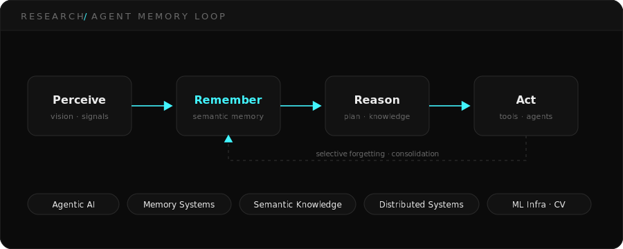
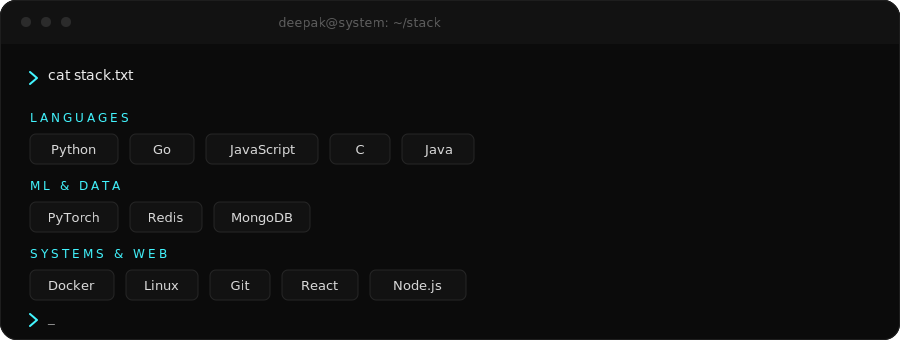
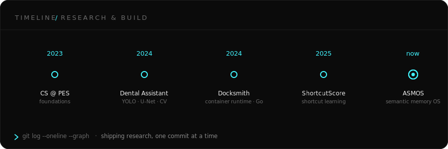

<!--
  ┌────────────────────────────────────────────────────────────────────┐
  │  C S Deepak · GitHub profile README                                  │
  │                                                                      │
  │  ⚠  To render on your PROFILE PAGE this repo must be named exactly   │
  │     `csdeepak`  →  github.com/csdeepak/csdeepak                      │
  │     (this clone is `deepak`). See SETUP.md.                          │
  │                                                                      │
  │  Palette:  bg #090909 · panel #121212 · accent #42F5FF · text #EDEDED │
  │  Edit points are marked  <!-- EDIT -->                               │
  └────────────────────────────────────────────────────────────────────┘
-->

<!-- ═══════════════ 1 · ANIMATED HERO BANNER ═══════════════ -->
<div align="center">
  
</div>

<br/>

<!-- ═══════════════ 2 · RESEARCH DASHBOARD ═══════════════ -->
<table border="0" width="100%">
  <tr>
    <td width="60%" valign="top">
      
    </td>
    <td width="40%" valign="top">
      
    </td>
  </tr>
</table>

<div align="center">
  
</div>

<br/>

<!-- ═══════════════ 3 · CURRENT MISSION ═══════════════ -->
## &nbsp;`~/` &nbsp; Current Mission

> **Design infrastructure that lets AI agents learn, remember, collaborate and reason.**
> I care about the systems layer of intelligence — how agents store knowledge, recall
> the right thing at the right time, and coordinate at scale.

```text
❯ cat focus.list
```

<table border="0">
  <tr>
    <td>▸ Multi-Agent Systems</td>
    <td>▸ AI Memory Architectures</td>
    <td>▸ Agent Infrastructure</td>
  </tr>
  <tr>
    <td>▸ ML Systems</td>
    <td>▸ Distributed Intelligence</td>
    <td>▸ Semantic Knowledge</td>
  </tr>
</table>

<br/>

<!-- ═══════════════ 4 · FEATURED RESEARCH ═══════════════ -->
## &nbsp;`~/research` &nbsp; Featured Research

<div align="center">
  
</div>

<table border="0" width="100%">
  <tr>
    <td width="50%" valign="top">

### ▸ ASMOS
**Adaptive Semantic Memory Operating System**

An OS-like memory layer for AI agents: **semantic checkpoints**, adaptive
memory, **selective forgetting**, and structured knowledge representation —
so agents remember what matters and let go of what doesn't.

`memory` · `agents` · `knowledge-representation`

<!-- EDIT: add repo link --> [`→ repository`](https://github.com/csdeepak)

</td>
<td width="50%" valign="top">

### ▸ ShortcutScore
**Measuring shortcut learning in deep models**

A method + metric for quantifying when neural networks exploit
**spurious shortcuts** instead of learning the intended signal —
toward models that generalise for the right reasons.

`deep-learning` · `evaluation` · `robustness`

<!-- EDIT: add repo link --> [`→ repository`](https://github.com/csdeepak)

</td>
  </tr>
</table>

<br/>

<!-- ═══════════════ 5 · PROJECTS ═══════════════ -->
## &nbsp;`~/projects` &nbsp; Selected Projects

<table border="0" width="100%">
  <tr>
    <td width="50%" valign="top">

### ▸ Docksmith
A **Docker-inspired container runtime** built from scratch in **Go** —
namespaces, cgroups, and an image/layer model to learn how containers
really work underneath the daemon.

`Go` · `linux` · `containers` · `systems`

[`→ repository`](https://github.com/csdeepak)

</td>
<td width="50%" valign="top">

### ▸ Intelligent Dental Assistant
A **computer-vision pipeline** for dental disease detection using
**YOLO** for localisation and **U-Net** for segmentation — from raw
radiographs to clinically-legible overlays.

`PyTorch` · `YOLO` · `U-Net` · `medical-CV`

[`→ repository`](https://github.com/csdeepak)

</td>
  </tr>
</table>

<div align="center">
  <a href="https://github.com/csdeepak?tab=repositories">
    
  </a>
</div>

<br/>

<!-- ═══════════════ 6 · TECH STACK ═══════════════ -->
## &nbsp;`~/stack` &nbsp; Tech Stack

<div align="center">
  
</div>

<div align="center">
  &nbsp;&nbsp;&nbsp;
  &nbsp;&nbsp;&nbsp;
  &nbsp;&nbsp;&nbsp;
  &nbsp;&nbsp;&nbsp;
  &nbsp;&nbsp;&nbsp;
  &nbsp;&nbsp;&nbsp;
  &nbsp;&nbsp;&nbsp;
  &nbsp;&nbsp;&nbsp;
  &nbsp;&nbsp;&nbsp;
  &nbsp;&nbsp;&nbsp;
  &nbsp;&nbsp;&nbsp;
  &nbsp;&nbsp;&nbsp;
  
</div>

<br/>

<!-- ═══════════════ 7 · GITHUB ANALYTICS ═══════════════ -->
## &nbsp;`~/metrics` &nbsp; GitHub Analytics

<div align="center">

  
  

  <br/><br/>

  

</div>

<!--
  Richer panel is rendered to ./assets/metrics.svg by .github/workflows/metrics.yml
  (needs METRICS_TOKEN secret). Uncomment when ready:
  <div align="center"></div>
-->

#### &nbsp;&nbsp;Recent Activity
<!--START_SECTION:activity-->
<!-- Auto-filled by .github/workflows/activity.yml after first run -->
<!--END_SECTION:activity-->

#### &nbsp;&nbsp;Weekly Coding <sub>(WakaTime — placeholder until connected)</sub>
<!--START_SECTION:waka-->
```text
No WakaTime data yet — connect an API key (see SETUP.md) and this fills in automatically.
Python     ███████████████░░░░░░░░░░   —
Go         ██████████░░░░░░░░░░░░░░░░   —
C          ████████░░░░░░░░░░░░░░░░░░   —
```
<!--END_SECTION:waka-->

<br/>

<!-- ═══════════════ 8 · CONTRIBUTION SNAKE ═══════════════ -->
## &nbsp;`~/activity` &nbsp; Contribution Graph

<div align="center">
  <picture>
    <source media="(prefers-color-scheme: dark)"  srcset="https://raw.githubusercontent.com/csdeepak/csdeepak/output/snake-dark.svg"/>
    <source media="(prefers-color-scheme: light)" srcset="https://raw.githubusercontent.com/csdeepak/csdeepak/output/snake-light.svg"/>
    
  </picture>
  <br/>
  <sub>generated every 12h · <code>.github/workflows/snake.yml</code></sub>
</div>

<br/>

<!-- ═══════════════ 9 · RESEARCH TIMELINE ═══════════════ -->
## &nbsp;`~/log` &nbsp; Research Timeline

<div align="center">
  
</div>

<br/>

<!-- ═══════════════ 10 · CONTACT ═══════════════ -->
## &nbsp;`~/contact` &nbsp; Get in Touch

```text
❯ ./say-hi.sh
> open to research collaborations, systems work, and hard problems.
```

<div align="center">

  <a href="mailto:csdeepak2005@gmail.com"></a>
  <a href="https://github.com/csdeepak"></a>
  <a href="https://www.linkedin.com/in/c-s-deepak-b1b41228b"></a>
  <a href="#"></a>

  <br/><br/>
  

</div>

<br/>

<!-- ═══════════════ 11 · FOOTER ═══════════════ -->
<div align="center">
  
  <br/>
  <sub><code>C S Deepak · PES University · Bangalore</code> · built with hand-written SVG · dark · cyan · terminal</sub>
</div>
